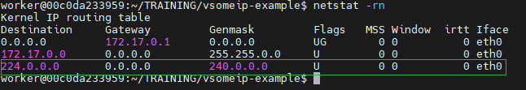
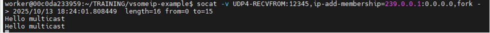
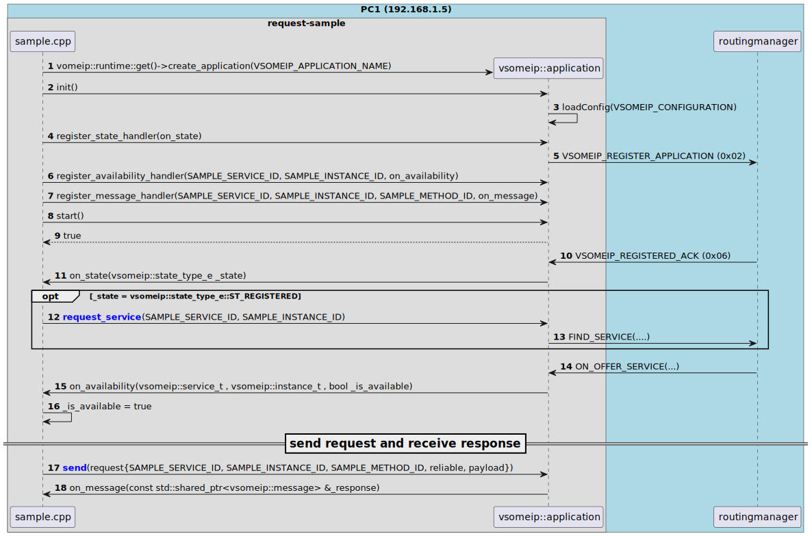
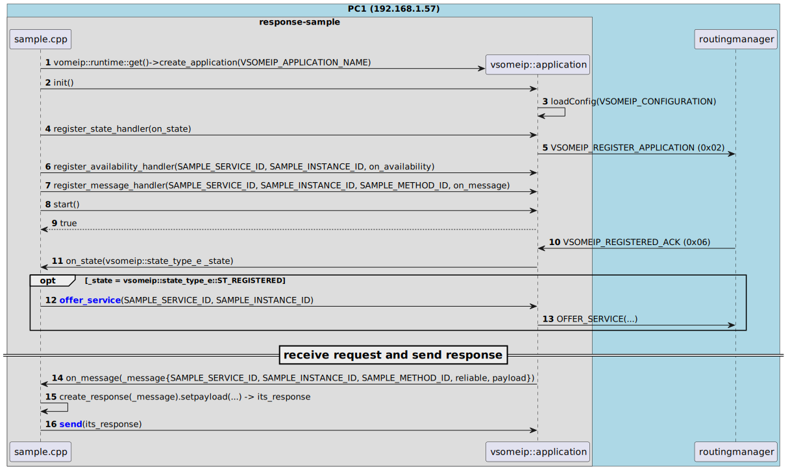
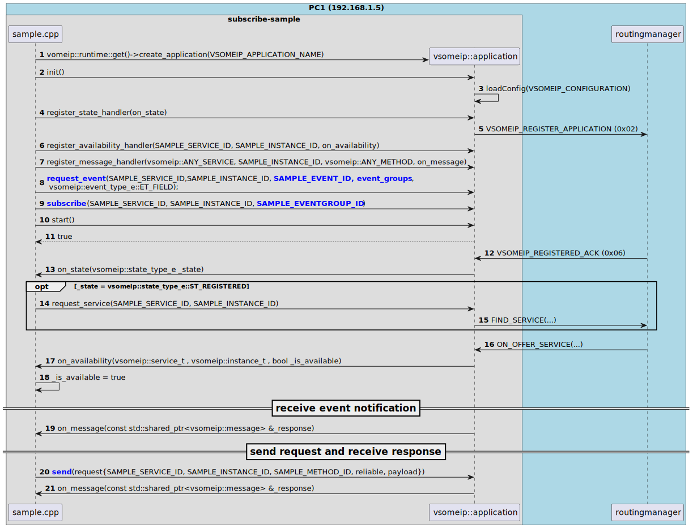
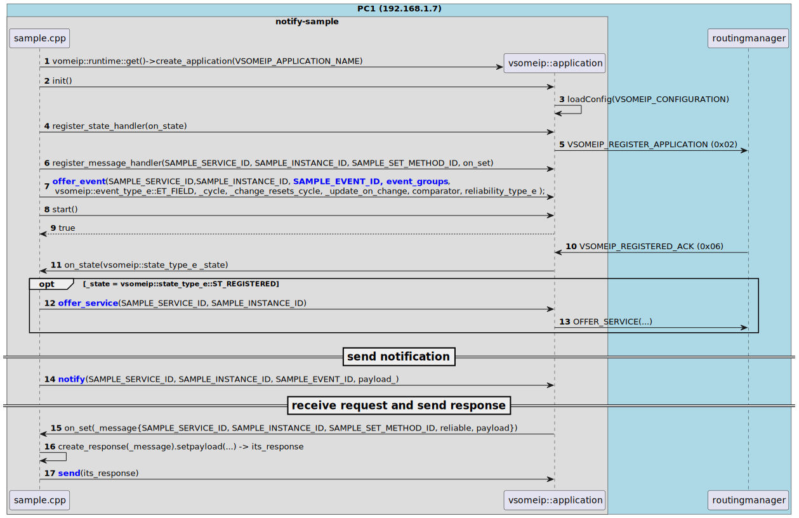

# 🚗 vsomeip-example

A simple project demonstrating inter-service communication using **vsomeip**.

<p align="center">
    <a href="./doc/Vsomeip_knowledge.pdf" style="font-size:1.5em; font-weight:bold;">
        📄 Vsomeip Knowledge PDF
    </a>
</p>

---

## 📘 Overview

This project showcases four roles:

- **Sender**: Sends service requests
- **Receiver**: Handles incoming requests
- **Subscriber**: Subscribes to event notifications
- **Notifier**: Sends notifications to subscribers

---

## 🖥️ Environment

- Two [VirtualBox](https://www.virtualbox.org/wiki/Downloads) Ubuntu hosts in **Bridged Mode**
- Ubuntu: [`ubuntu-22.04.5-desktop-amd64.iso`](https://releases.ubuntu.com/jammy/)

---

## ⬇️ Download & Install Prerequisites

### 1️⃣ Download vsomeip-example

```bash
# Install essential tools
sudo apt update
sudo apt install -y openssh-server screen git
sudo apt install -y net-tools netcat socat tcpdump

# Clone example and install dependencies
git clone https://github.com/minhthedt/vsomeip-example.git
cd vsomeip-example
sudo ./set_env.sh 2>&1 | tee log.txt
```

### 2️⃣ Build vsomeip-example

```bash
cd vsomeip-example
sudo ./build.sh
# Output: ./vsomeip-example/bin/...
```

### 3️⃣ **[IMPORTANT] Ensure Multicast Connectivity**

> Make sure both PCs can send/receive multicast before testing.

```bash
# (Optional) Route all multicast traffic (224.0.0.0/4) via eth0
ifconfig
sudo ip route add 224.0.0.0/4 dev eth0
# or: sudo route add -net 224.0.0.0/4 dev eth0

# Show routing table
netstat -rn
```
<p align="center">
    
</p>

```bash
# Sender
echo "Hello multicast" | socat - UDP4-DATAGRAM:239.0.0.1:12345

# Receiver
socat -v UDP4-RECVFROM:12345,ip-add-membership=239.0.0.1:0.0.0.0,fork -
```
<p align="center">
    
</p>

---

## ▶️ Run Tests

> **Set correct IP addresses in `./vsomeip-example/config/*.json` before running tests.**

### Test 1: [vsomeip] Request/Response

- **PC1:**
    ```bash
    cd vsomeip-example
    sudo ./bin/run_response_sample.sh
    ```
- **PC2:**
    ```bash
    cd vsomeip-example
    sudo ./bin/run_request_sample.sh
    ```

### Test 2: [vsomeip] Publish-Subscribe (Events)

- **PC1:**
    ```bash
    cd vsomeip-example
    sudo ./bin/run_notify_sample.sh
    ```
- **PC2:**
    ```bash
    cd vsomeip-example
    sudo ./bin/run_subscribe_sample.sh
    ```

### Test 3: [vsomeip + commonapi] Get/Set/Notify/Field

- **PC1:**
    ```bash
    cd vsomeip-example
    sudo ./bin/run_HelloWorldService.sh
    ```
- **PC2:**
    ```bash
    cd vsomeip-example
    sudo ./bin/run_HelloWorldClient.sh
    ```

---

## 📝 Sequence Diagrams

| Scenario                | Diagram |
|-------------------------|---------|
| Request Sample          |  |
| Response Sample         |  |
| Subscribe Sample        |  |
| Notify Sample           |  |

---

## 📝 Logging

| Description                                 | Image |
|---------------------------------------------|-------|
| OfferService Repetition Pattern             |  |
| SOME/IP SD (OfferService)                   | .png) |
| SOME/IP Request/Response via TCP            | .png) |

---