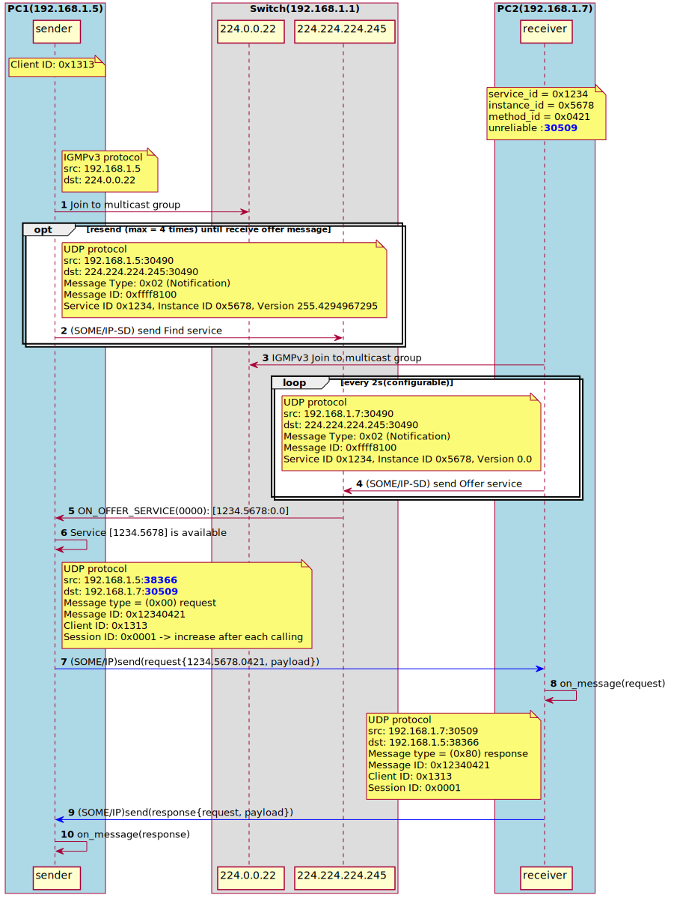
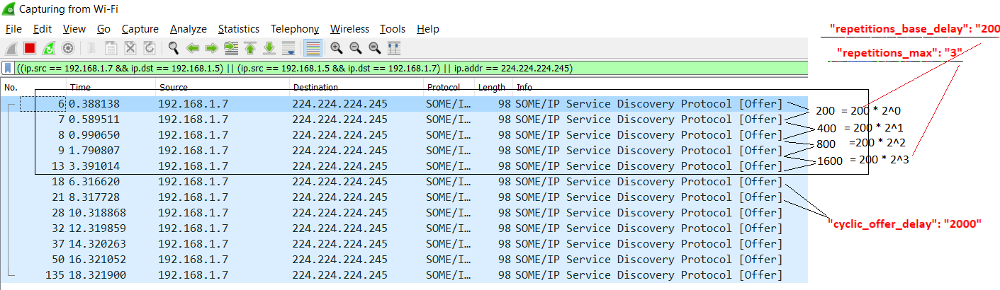

# 🚗 vsomeip-example

A basic example project demonstrating communication between services using **vsomeip**.

## 📘 Overview

This project includes the following roles:

- **Sender**: Sends service requests
- **Receiver**: Handles incoming requests
- **Subscriber**: Subscribes to event notifications
- **Notifier**: Sends out notifications to subscribers

## 🖥️ Environment

- Two [Virual Box](https://www.virtualbox.org/wiki/Downloads) Ubuntu hosts configured in **Bridged Mode**
- Ubuntu Version: [`ubuntu-22.04.5-desktop-amd64.iso`](https://releases.ubuntu.com/jammy/)

## ⬇️ Download & Install Prerequisites
#### Download vsomeip-example
```
# Install Essential Tools
sudo apt update
sudo apt install -y openssh-server screen git
sudo apt install -y net-tools netcat socat tcpdump
sudo apt install dlt-daemon libdlt-dev dlt-tools

# Download example and install Cmake, boost, dlt, vsomeip
git clone https://github.com/minhthedt/vsomeip-example.git
sudo ./set_env.sh 2>&1 | tee log.txt
```
#### Build vsomeip-example
```bash
cd vsomeip-example
mkdir build
cd build
cmake ..
make -j"$(nproc)"
make install
```
#### <h4 style="color:#0074D9">Verify Multicast (make sure 2 PC can send/receive multicast)</h4>
```
#(optional) all traffic destined for any multicast address (224.0.0.0/4) out through the enp0s3 network interface.
    ifconfig
    sudo ip route add 224.0.0.0/4 dev enp0s3
#show routing table
    netstat -rn

#sender
    echo "Hello multicast" | socat - UDP4-DATAGRAM:239.0.0.1:12345
#receiver
    socat -v UDP4-RECVFROM:12345,ip-add-membership=239.0.0.1:0.0.0.0,fork -
```

## 📝 Design Overview

#### 1) Server init


#### 2) OfferService Repetition Pattern


#### 3) someip_udp_packet(offerservice)
.png)

#### 4) someip_tcp_packet(request_response)
.png)